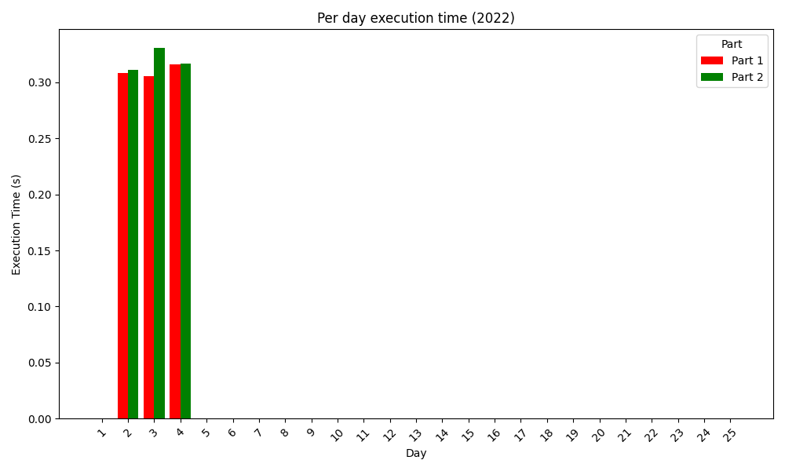
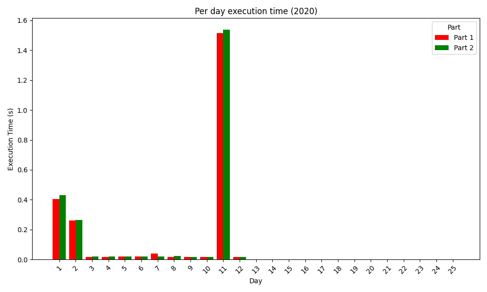
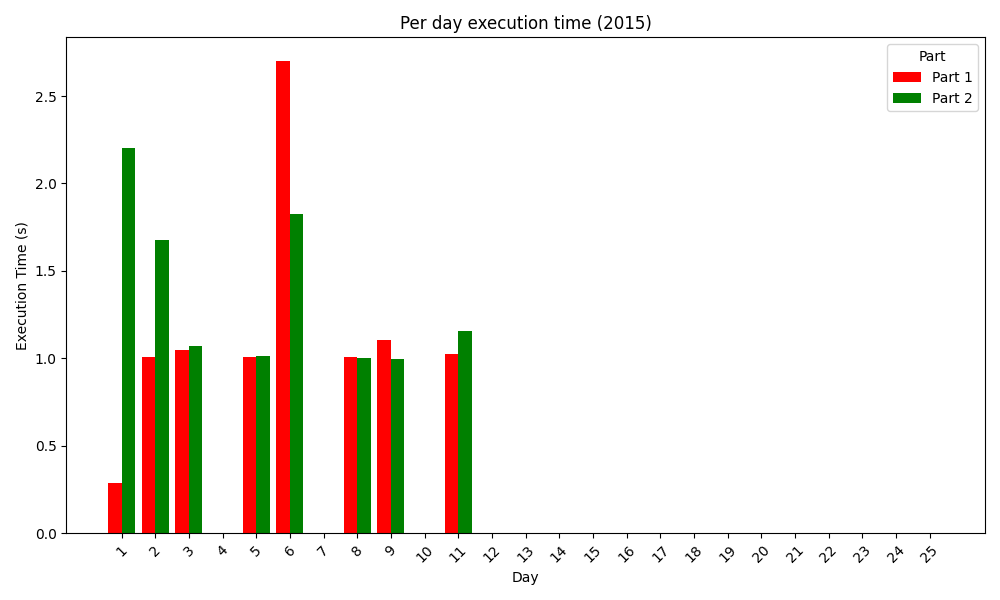

### 2023

  
Stats

  

### 2022

  
Stats

  

### 2021

  
Stats

  

### 2020

  
Stats

  

### 2019

  
Stats

  

### 2018

  
Stats

  

### 2017

  
Stats

  

### 2016

  
Stats

  

### 2015

  
Stats

  

